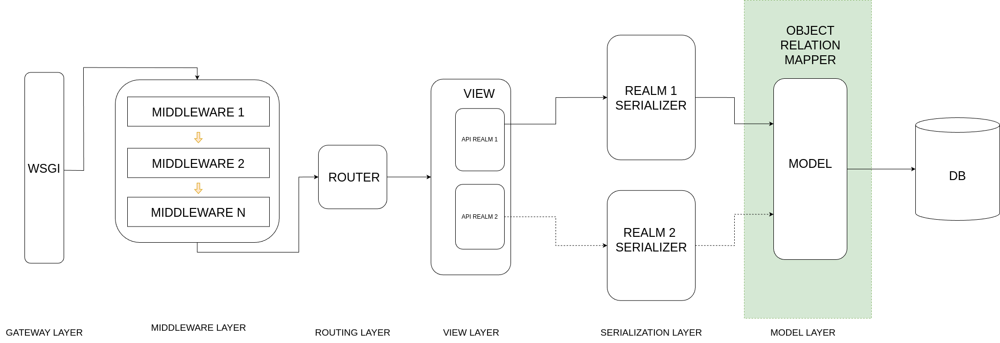

<!-- PROJECT LOGO -->
 

    

  <h3 align="center">Lightbug API</h3>

  

    🐝 Author APIs in Pure Mojo 🔥
     

   ![Written in Mojo][language-shield]
   [![MIT License][license-shield]][license-url]
   [![Contributors Welcome][contributors-shield]][contributors-url]
   [![Join our Discord][discord-shield]][discord-url]
   
   

  

## Overview

High Level Architecture

    
    

This diagram illustrates a high-level architecture for a web framework in Mojo, designed with scalability, quick development, and developer-friendliness in mind. The architecture follows a layered approach, with each layer responsible for specific functionalities, making it easy to integrate with various components and request frameworks.

## 1. Gateway Layer
- This layer serves as the entry point for the web application.
- WSGI (Web Server Gateway Interface) is the standard interface used for communication between web servers and web applications.

## 2. Middleware Layer
- This layer consists of multiple middlewares (Middleware 1, Middleware 2, ..., Middleware N) basically a stack of function calls.

- Each Request will go through the middleware stack from top to bottom before being passed to Routing Layer and all responses will go through the same middleware stack from bottom to top.

- Middleware components are responsible for handling cross-cutting concerns, such as authentication, logging, caching, and other common functionalities.
- They can be easily plugged in or removed based on the application's requirements.
- These Middlewares are order sensitive 

## 3. Routing Layer
- This layer contains a Router component responsible for mapping incoming requests to the appropriate handlers or views.
- The Router analyzes the request and delegates it to the corresponding view or controller.

## 4. View Layer
- This layer contains views or templates that handle the presentation logic of the web application.
- The View component receives data from the Router and renders the appropriate response.
- In this architecture, there are two example views: API Realm 1 and API Realm 2, representing different types of request frameworks such as REST API, GraphQL, HTTP Templates, and various other RPC methods.

## 5. Serialization Layer
- This layer handles the serialization and deserialization of data between the application and external systems or databases.
- It consists of realm specific serializer (responsible for validating data, carrying out pre-model layer business logic*) corresponding to the different request frameworks in the View Layer.

## 6. Model Layer 
- This layer interacts with the Database (DB) component for persisting and retrieving data, using Object Relation Mapping (ORM) for NoSQL and SQL databases which will have their own implementation to carry out the actual database operations.

The architecture is designed to be highly scalable, allowing for easy integration of new components or modules, including different types of request frameworks such as REST API, GraphQL, HTTP Templates, and various RPC methods. The separation of concerns between layers promotes code reusability, maintainability, and testability. Additionally, the modular design and the use of well-established patterns make it beginner-friendly, enabling developers to quickly understand and contribute to the codebase.

(* This is the intended flow, but it can be overridden using signals/transaction)

Lets Discuss over it... Please feel free to suggest/contribute and any challenges you faced with your current backend framework and would like to point them out we would surely love to consider them and work on them  

More will come...

<!-- MARKDOWN LINKS & IMAGES -->
<!-- https://www.markdownguide.org/basic-syntax/#reference-style-links -->
[language-shield]: https://img.shields.io/badge/language-mojo-orange
[license-shield]: https://img.shields.io/github/license/saviorand/lightbug_http?logo=github
[license-url]: https://github.com/saviorand/lightbug_http/blob/main/LICENSE
[contributors-shield]: https://img.shields.io/badge/contributors-welcome!-blue
[contributors-url]: https://github.com/saviorand/lightbug_http#contributing
[discord-shield]: https://img.shields.io/discord/1192127090271719495?style=flat&logo=discord&logoColor=white
[discord-url]: https://discord.gg/VFWETkTgrr

## Contributors
Want your name to show up here? See [CONTRIBUTING.md](./CONTRIBUTING.md)!

Made with [contrib.rocks](https://contrib.rocks).